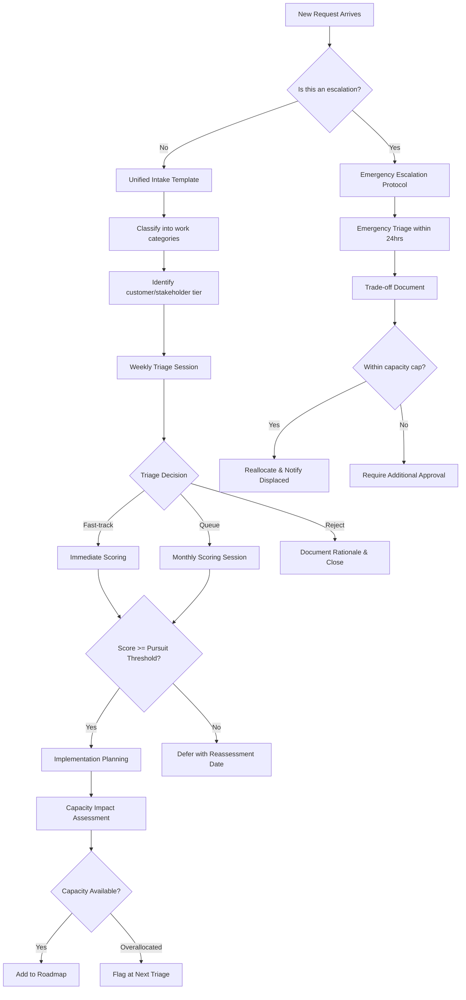

# Design Document — Operational Framework Example

## Overview

This design shows the output structure Kiro generates from the requirements. When you run the Kiro spec workflow against your customized `requirements.md`, it produces a design like this — adapted to your team's specifics.

The framework is delivered as a layered system:

| Tier | Deliverable | Purpose |
|------|-------------|---------|
| **Tier 1** | Alignment document (Markdown) | Canonical reference — shareable, reviewable, version-controlled |
| **Tier 2** | Interactive decision tool (HTML) | Day-to-day tactical tool — clickable flows, expandable panels |
| **Tier 3** | Supporting templates | Intake form, scorecard, trade-off doc, decision record, capacity ledger |

---

## Architecture

```
┌─────────────────────────────────────────────────────┐
│              Tier 1: Alignment Document              │
│  (Markdown — shareable, reviewable, version-controlled) │
├─────────────────────────────────────────────────────┤
│           Tier 2: Interactive Decision Tool           │
│  (Self-contained HTML — clickable, expandable, daily use) │
├─────────────────────────────────────────────────────┤
│              Tier 3: Supporting Templates             │
│  (Intake form, scorecard, capacity ledger,           │
│   trade-off doc, decision record)                    │
└─────────────────────────────────────────────────────┘
```

---

## Decision Pipeline Flow

Every request enters through a single pipeline:



---

## Interactive Tool (HTML)

The interactive tool is a single self-contained HTML file:

### Technology Choices

| Concern | Choice | Rationale |
|---------|--------|-----------|
| Diagrams | Mermaid.js via CDN | No build step, renders in-browser |
| Interactivity | Vanilla JS + `<details>/<summary>` | Zero dependencies, works offline |
| Styling | Embedded CSS with custom properties | Single-file deployment |
| Print | `@media print` rules | Native browser print-to-PDF |

### Interactive Features

1. **Clickable Mermaid nodes** — each node scrolls to the corresponding detail panel
2. **Collapsible panels** — native `<details>/<summary>` for each framework component
3. **Scoring reference** — inline table with score definitions and examples
4. **Cadence calendar** — HTML table with weekly/monthly/quarterly rhythm
5. **Process health dashboard** — static reference with metrics and thresholds
6. **Print CSS** — expands all panels, removes nav, adds page breaks

---

## Templates Generated

The spec workflow produces these templates in the design:

1. **Intake Request Template** — captures requestor, customer segment, description, scope, category
2. **Scoring Scorecard** — scorer grid, multipliers, weighted score calculation, disposition
3. **Trade-off Document** — displaced initiatives, capacity redirected, revised allocation
4. **Decision Record** — request details, scores, disposition, rationale, retention
5. **Capacity Ledger** — committed vs. available per quarter, overallocation flags
6. **Stakeholder Request Log** — tracking volume and outcomes of external requests

---

## How This Was Generated

This design was produced by Kiro's spec workflow from the `requirements.md` in this directory. The process:

1. Requirements define WHAT the framework must do (user stories + acceptance criteria)
2. Design defines HOW — architecture, flows, templates, data models, edge cases
3. Tasks (in `tasks.md`) define the implementation steps — which for operational frameworks means "write these specific sections of the alignment doc" and "build this HTML page"

The output is documents and tools, not application code. But the structured process ensures nothing is missed and the design is traceable back to requirements.
