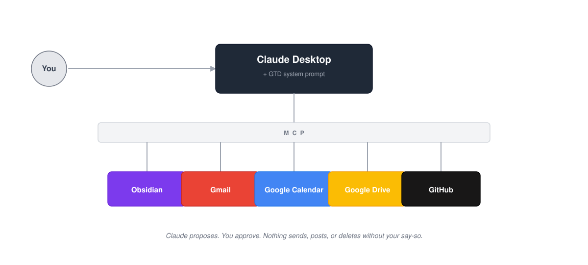

# GTD Claude Agent

A personal AI assistant that lives in Claude Desktop, knows your task system, and connects to your real tools — Gmail, Calendar, and Obsidian.

Built on [GTD (Getting Things Done)](https://gettingthingsdone.com/) principles: capture everything, clarify what it means, organize it where it belongs, reflect regularly, and engage with confidence.

---

## What this is

This is an open-source starter kit for building your own AI-powered personal assistant using [Claude](https://claude.ai) and the [Model Context Protocol (MCP)](https://modelcontextprotocol.io/).

MCP is what lets Claude talk to your actual tools — read your notes, check your calendar, draft emails, and more. Think of it as giving Claude hands instead of just a brain.

You get:
- A ready-to-use system prompt built around GTD methodology
- Configuration files to connect Claude to your tools
- Step-by-step setup guides written for non-developers

Once set up, Claude becomes a personal assistant that understands your task system and can take action across your tools — with your approval.

---

## What it does

- **Processes your inbox** — Reads captures in Obsidian and routes them to the right folder (Next Actions, Projects, Someday Maybe, etc.)
- **Manages email** — Triages your Gmail inbox, drafts replies, and flags what needs attention
- **Handles your calendar** — Checks upcoming events, finds free time, and creates new events
- **Runs weekly reviews** — Walks through your whole system to make sure nothing is slipping through the cracks

---

## What you need

| Tool | What it is | Cost |
|------|-----------|------|
| [Claude Pro or Max](https://claude.ai/upgrade) | The AI subscription that powers everything | $20/month |
| [Claude Desktop](https://claude.ai/download) | The app Claude runs in on your computer (Mac or Windows) | Free |
| [Obsidian](https://obsidian.md/) | A note-taking app that stores files locally — your GTD home base | Free |

> **Beginner vs. Advanced:** The setup guides below get you running with Obsidian + Gmail + Calendar. For additional connections (Google Drive, GitHub, Slack), see [docs/advanced-connectors.md](docs/advanced-connectors.md).

---

## What Claude does vs. what you do

| Claude handles | You handle |
|---------------|-----------|
| Reading and writing notes in your Obsidian vault | Following the setup guide (one-time, about 30 minutes) |
| Drafting emails and sorting your inbox | Reviewing drafts before Claude sends anything |
| Routing tasks to the right GTD folder | Approving any action that posts, sends, or deletes |
| Surfacing what's due, stale, or forgotten | Deciding your priorities — Claude helps, you choose |
| Running weekly reviews across all your tools | Maintaining your Obsidian vault structure |

**The key rule: Claude proposes, you approve.** Nothing gets sent, posted, or deleted without your say-so.

---

## Companion projects

`gtd-claude-agent` is part of a small set of Claude + MCP projects I've open-sourced. They share the same design idea: plain-text or plain-data outputs you own, read by Claude through MCP.

- **[platemath](https://github.com/joegarvey-ai/platemath)** — automated health data pipeline for lifters. Pulls nutrition from Cronometer and sleep/activity from Apple Watch (via Apple Health) into an Obsidian vault as clean markdown. Claude reads the vault through the Obsidian MCP to answer questions about macros, recovery, and training readiness.
- **[SpendSense](https://github.com/joegarvey-ai/spendsense)** — personal finance intelligence layer. Syncs bank transactions via SimpleFIN Bridge, categorizes them with regex rules, writes an Excel dashboard with SUMIFS formulas, sends a weekly Monday Money Brief email digest, and tracks investments with live market data from yfinance.

If you like the approach in `gtd-claude-agent`, these are the same pattern applied to different domains.

---

## Getting started

### Choose your setup guide

Follow the guide for your computer. No coding experience required — just downloading apps and copying text.

🍎 **Mac users →** [SETUP-MAC.md](SETUP-MAC.md)

🪟 **Windows users →** [SETUP-WINDOWS.md](SETUP-WINDOWS.md)

If you run into problems, check the [Troubleshooting Guide](TROUBLESHOOTING.md).

---

## Built by

**Joe Garvey** — Head of Developer Technology

See [Companion projects](#companion-projects) above for the rest of the stack.

---

## License

MIT — fork it, make it yours, share what you build.
